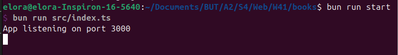
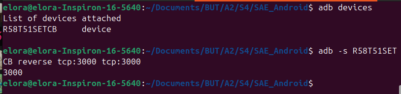

# Mode d'emploi API

Afin de lancer notre API, allez dans le dossier `books` :  

```bash
cd books/
```

Exécutez ensuite la commande suivante afin de démarrer l'API :  

```bash
bun run start
```

L'API est désormais lancée. Vous devriez voir apparaître les lignes suivantes dans votre terminal :  



> ⚠️ Une fois que vous aurez fini d'utiliser l'application Android, faites Ctrl+C dans le terminal où vous avez lancé l'API afin de l'éteindre.

---

## Lancer l'application Android

**Si vous utilisez un émulateur** et non un téléphone physique, il vous faudra changer l'url de l'API dans le code de l'application (dans l'application Android, pas dans l'API).

Ouvrez dans votre explorateur de fichier le dossier contenant ce dépôt. Allez dans le dossier `AndroidBooksClient/app/src/main/java/p42/androidbooksclient/db/`. Vous y trouverez divers fichiers mais celui qui nous intéresse ici est `Repository.java`.
Ouvrez ce fichier avec un éditeur et remplacez la ligne suivante : 

```java
private static final String API_URL = "http://127.0.0.1:3000/";
```

par 

```java
private static final String API_URL = "http://10.0.2.2:3000/";
```


**Si vous utilisez un téléphone physique**, ouvrez un terminal et tapez les commandes suivantes : 

```bash
adb devices
```

```bash
adb -s R58T51SETCB reverse tcp:3000 tcp:3000
```

Remplacez ici R58T51SETCB par ce que vous a renvoyé la première commande (voir image ci-dessous).



> ⚠️ Attention ! Pour que l'application puisse faire des requêtes depuis votre téléphone, il vous faut être sur le même réseau wifi que celui de la machine où est lancée l'API.


Vous pouvez désormais lancer l'application.
